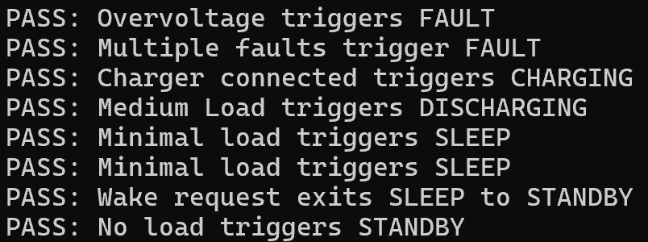
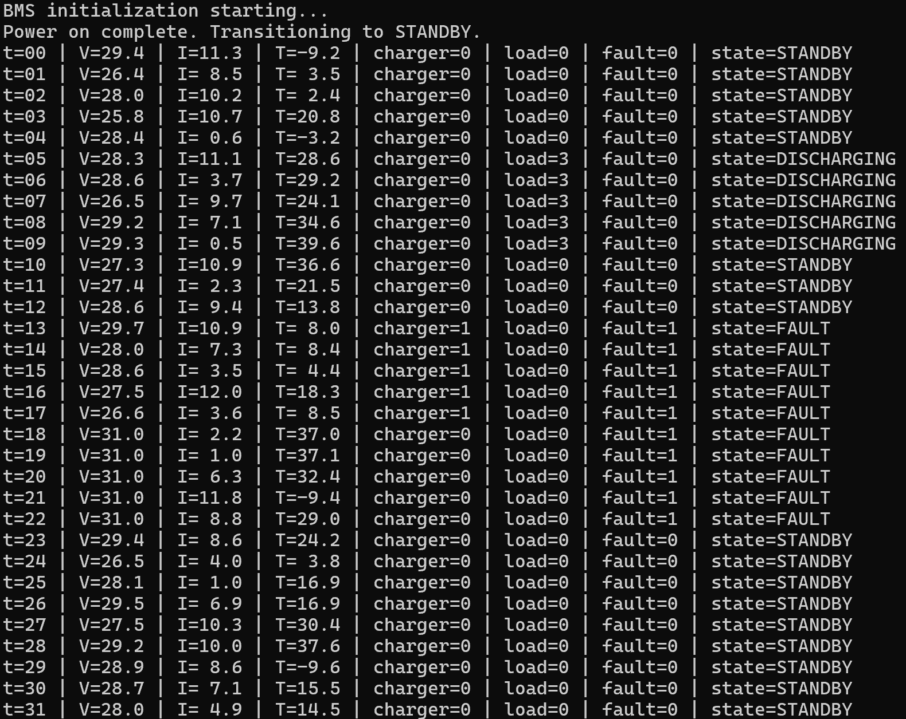

# Rover BMS Simulation Personal Project  
Created by: Tianna Sequeira  
Date: January 2026  

**Note: This project is currently a work in progress**  

## Objective:
The goal of this project is to simulate a Battery Management System (BMS) for a rover, capable of transitioning between operational states based on sensor inputs and environmental conditions. The system monitors battery health and enforces safe operating limits while managing charge and discharge behavior.  

This project is relevant to automotive and aerospace applications, where autonomous or semi-autonomous vehicles must adapt to changing environments while maintaining energy efficiency, safety, and system reliability.

### Project Goals:
- Monitor battery voltage, current and temperature
- Implement state-based logic for charging, discharging, standby, and fault conditions
- Communicate with embedded hardware or simulated systems
- Implement control algorithms for battery charging and discharging
- Integrate automated testing and CI/CD pipelines for continuous integration and delivery
- Support model-based design and code generation workflows

### Skill Goals:
- Embedded C Programming
- Model-Based Design
- CI/CD Piplines
- Communication Protocols
- Testing (Software, Unit and Integration)

## Software Used
| Software | Used for | Link (if applicable) | 
|----|-----|-----|
| Embedded C | Core BMS Logic and Control Implementation | N/A |
| Git | Version control and collaborative development | https://git-scm.com/ |
| PlantUML | Developing State Machine Diagrams | https://plantuml.com/ |
| CAN | Communication between BMS and other subsystems | |
| GitLab| Automated build, test and deployment piplines | https://about.gitlab.com/ |
| Google Test | Unit and integration testing framework | https://github.com/google/googletest |
| (Future) Bazel | Build System for compipling embedded code and managing dependencies | https://bazel.build/ |
| (Future) FreeRTOS | RTOS - Task scheduling, timing, and real-time behaviour simulation | https://www.freertos.org/ |
| (Future) MATLAB Simulink | Model-based Design and control algorithm simulation | https://www.mathworks.com/products/simulink.html |

# Using the Repository

### Run the State Test Script
gcc -Wall -Wextra -I./src/bms -o tests/state_tests tests/state_tests.c src/bms/bms.c

/tests/state_tests

### Run the Sim with Randomized Data
gcc -Wall -Wextra -I./src/bms -o build/bms_sim src/main_randsim.c src/bms/bms.c

./build/bms_sim

### Run the Sim with Randomized Data
NOTE: run once:
mkfifo /tmp/bms_cmd

#### On Terminal 1
gcc -Wall -Wextra -I./src/bms -o build/bms_sim_fifo src/main_fifo.c src/bms/bms.c

./build/bms_sim_fifo

#### On Terminal 2
echo -n [letter] > /tmp/bms_cmd

OR

cat > /tmp/bms_cmd

| Letter | Action           |
| ------ | --------------   |
| c      | charging         |
| d      | discharging      |
| f      | randomized fault |
| w      | wake from sleep  |
| r      | fault reset      |
| s      | standby          |