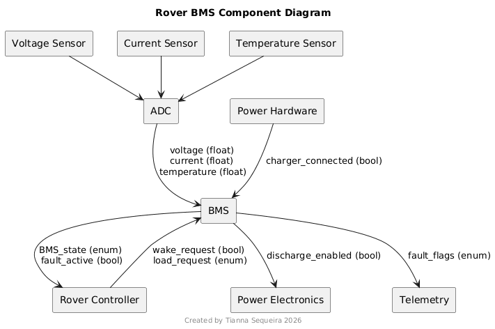

# BMS Interface

## Inputs:
- Battery voltage (V)
- Battery current (A)
- Battery Temperature (°C)
- Charger Connected
- Load Level Request
- Wake Request

## Outputs:
- BMS State
- Charge Enable
- Discharge Enable
- Fault Active
- Fault Flags

## Input Output Diagram
