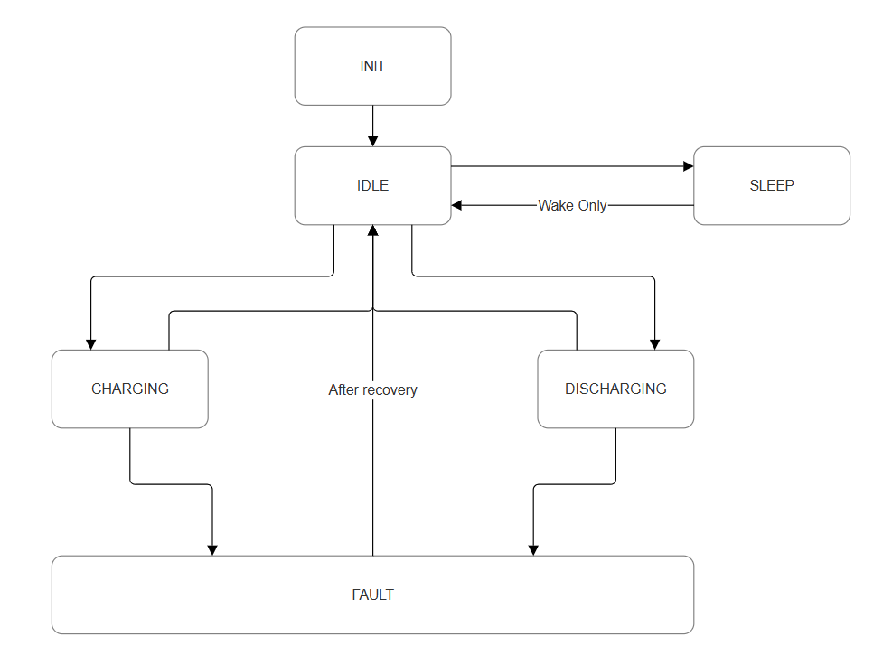

# BMS States

| Condition                             | Rover Operational Mode                | BMS State     |
|---------------------------------------|---------------------------------------|---------------|
| Power on                              | System Start Up                       | INIT          |
| Voltage, current or temperature fault | Any                                   | FAULT         |
| External power source detected        | Any                                   | CHARGING      |
| Active power demand detected          | Movement / Processing / Communication | DISCHARGING   |
| System powered, minimal activity      | Standby                               | IDLE          |
| Low SOC or extended inactivity        | Hibernation                           | SLEEP         |

## BMS State Machine
